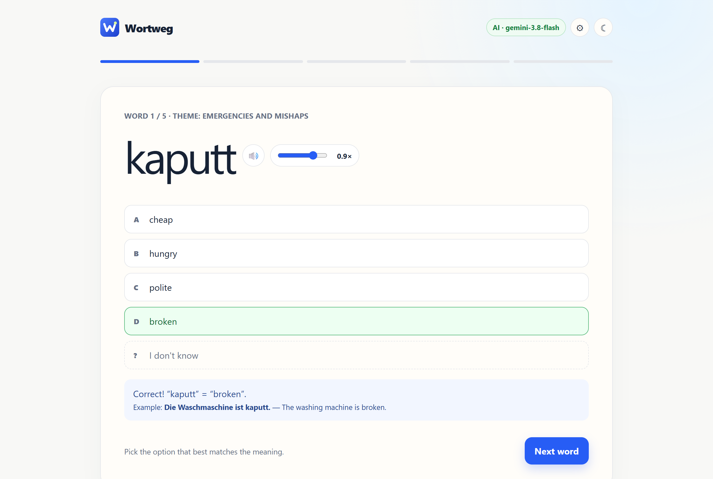
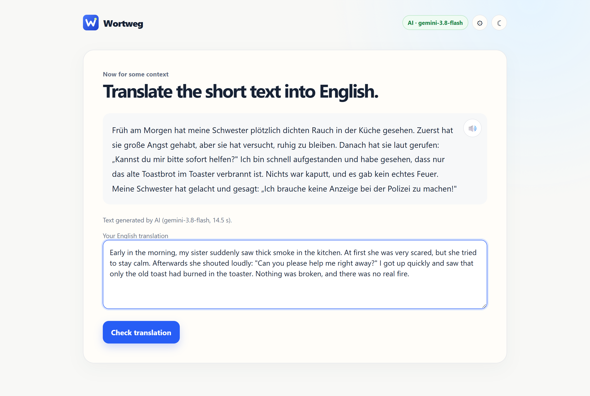
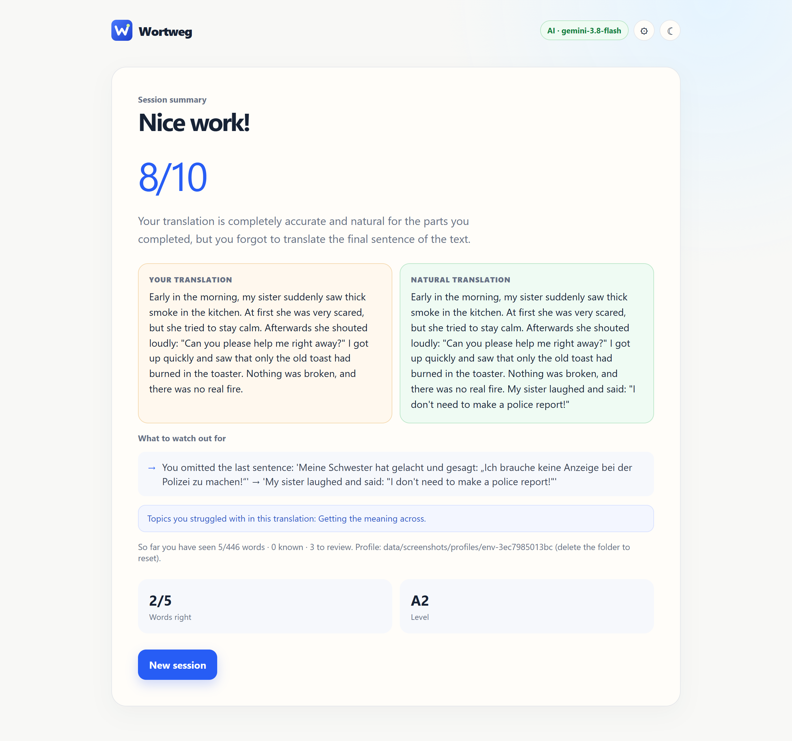
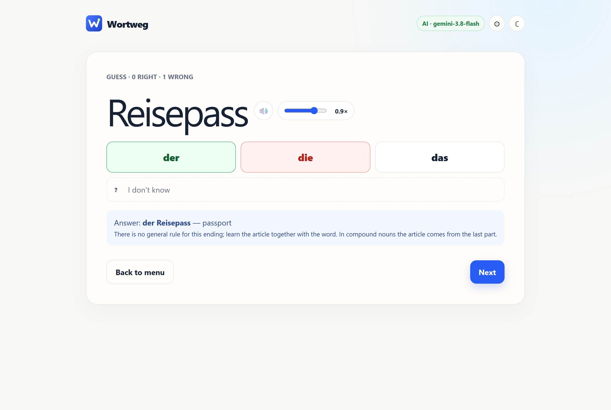
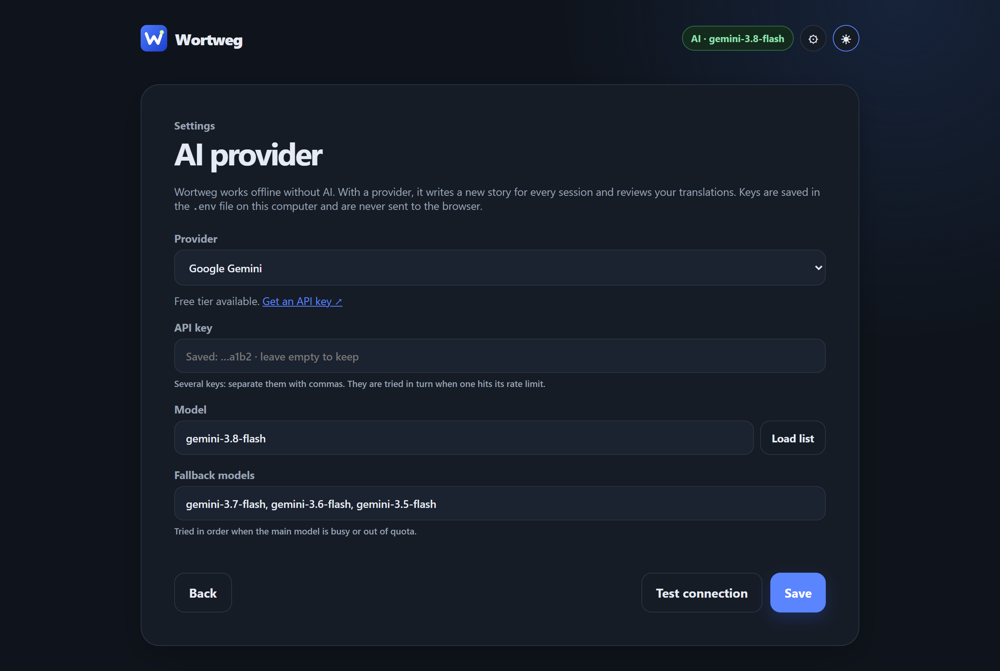

<p align="center"></p>

<h1 align="center">Wortweg</h1>

<p align="center"><b>Learn German vocabulary in context.</b><br>5 words → a short story that uses them → your translation → feedback.</p>

<p align="center">
  <a href="https://github.com/kpsvg2/wortweg/actions/workflows/ci.yml"></a>
  <a href="LICENSE"></a>
  
  
  <a href="https://kpsvg2.github.io/wortweg/"></a>
</p>

<p align="center"></p>

Wortweg gives you five German words in a quick quiz, then a short story that uses all of them, which you translate. An AI writes a fresh story every session and reviews your translation; without an AI key the app still works fully offline with built-in sentence templates.

**[Try the demo](https://kpsvg2.github.io/wortweg/)** (offline mode, runs entirely in your browser).

## Features

- **5 words → 1 story → your translation → feedback.** A small spaced-repetition scheduler picks the words: unknown ones come back after a few sessions, known ones rarely.
- **Four levels (A1–B2).** The story's grammar grows with you: present tense at A1, Perfekt at A2, subordinate clauses and zu-infinitives at B1, Konjunktiv II at B2.
- **Both directions.** The translation step alternates between German → English and English → German.
- **Learns your weak spots.** The AI tags your mistakes (verb position, cases, separable verbs …) and the next stories practise exactly those.
- **Articles mode.** Every noun you know is drilled for der/die/das; the ones you miss come back more often.
- **Guess mode.** Guess the article from the noun's ending and learn the rule behind it (‑ung → die, ‑chen → das …).
- **Read-aloud** with your system's German voice, adjustable speed.
- **Grows by itself.** When a theme runs low on new words, the AI adds more; every generated word passes the same validator as the built-in ones.
- **Any AI provider.** Gemini (free tier), Claude, OpenAI, OpenRouter, Groq, Mistral, DeepSeek, or a local model via Ollama / LM Studio — switch in the app, no restart.
- **Private by design.** Runs on your computer. Your API key never reaches the browser; progress is stored in a local folder.
- **Dark mode, mobile layout, installable (PWA).**

446 built-in words across 20 everyday themes (daily routine, shopping, work, health, travel …), each with a level, an example sentence and an English translation.

<table>
  <tr>
    <td></td>
    <td></td>
  </tr>
  <tr>
    <td></td>
    <td></td>
  </tr>
</table>

## Quick start

You need [Node.js](https://nodejs.org) 18 or newer. There is nothing to install.

```bash
git clone https://github.com/kpsvg2/wortweg.git
cd wortweg
npm start            # then open http://localhost:4173
```

On Windows you can also double-click **`Wortweg.cmd`**: it starts the server in the background and opens your browser. The server stops by itself 15 minutes after you close the page.

### Turn on the AI (optional)

Click **⚙** in the top-right corner, pick a provider, paste a key, press **Test connection**, then **Save**. The easiest free option is Google Gemini: get a key at <https://aistudio.google.com/apikey>.

| Provider | Key | Notes |
|---|---|---|
| Google Gemini | [aistudio.google.com](https://aistudio.google.com/apikey) | Free tier; several keys and fallback models supported |
| Anthropic Claude | [console.anthropic.com](https://console.anthropic.com/settings/keys) | |
| OpenAI | [platform.openai.com](https://platform.openai.com/api-keys) | |
| OpenRouter | [openrouter.ai](https://openrouter.ai/keys) | One key for many models, some free |
| Groq | [console.groq.com](https://console.groq.com/keys) | Free tier |
| Mistral, DeepSeek | their consoles | |
| Ollama, LM Studio | — | Local models, no key |
| Any OpenAI-compatible API | — | Set the base URL |

Settings are saved to a `.env` file in the project folder; you can also edit it by hand (see [`.env.example`](.env.example) and [docs/CONFIGURATION.md](docs/CONFIGURATION.md)).

## How a session works

1. **Pick a level.** The next session is prepared in the background, so starting is instant.
2. **Quiz.** Five German words, four English options each (or "I don't know").
3. **Translate.** A 5–7 sentence story that uses all five words, in German or English.
4. **Review.** A score, corrections, a natural reference translation and the grammar topics to watch. Progress is saved, and the next story focuses on what went wrong.

## Project structure

```
app/                 the web app (plain HTML/CSS/JS, no build step)
  data/vocabulary.js   built-in words and themes
  js/                  engine (sentences), session (word selection), validate,
                       mistakes, articles, app (UI)
server/              Node server: static files, profile storage, AI proxy, settings
  providers.mjs        provider presets and API calls
  ai.mjs               prompts, fallback models, key rotation
  vocab-expand.mjs     AI-generated vocabulary
tests/               offline checks (npm test) and live AI checks
tools/               screenshot generator
windows/             one-file Windows installer
data/                your local data, never committed
```

## Development

```bash
npm test               # offline: vocabulary, 3,200 generated lessons, scheduler simulation,
                       # levels, articles, provider config, server API
npm run test:ai        # live: lesson variety and review quality (uses your API quota)
npm run test:vocab-ai  # live: AI-generated words pass validation
npm run history        # analyse your own usage log
npm install && npm run screenshots   # regenerate docs/screenshots (needs Edge or Chrome)
```

See [CONTRIBUTING.md](CONTRIBUTING.md) for adding words, themes or providers.

## Your data

Progress lives in `data/profiles/env-<id>/` (one folder per computer and install path): `progress.json`, `vocab-extra.json` (words the AI added) and `ai-log.jsonl`. Delete the folder to start over. In the demo or any static hosting, progress is kept in the browser's localStorage instead.

## License

[MIT](LICENSE) © Kerem
